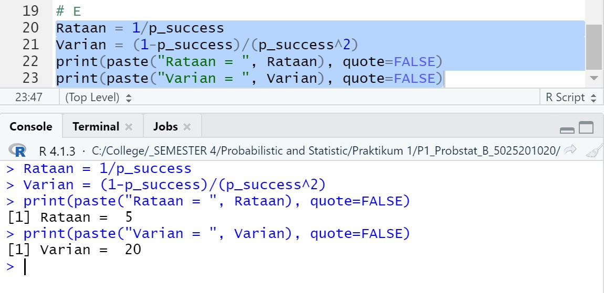

# P1_Probstat_B_5025201020
## Laporan Praktikum Modul 1 Probabilitas dan Statistik 2022

**Nama  : Muhammad Ferdian Iqbal**

**NRP   : 5025201020**

**Kelas : B**

***

## **Soal 1**
Seorang penyurvei secara acak memilih orang-orang di jalan sampai dia bertemu dengan seseorang yang menghadiri acara vaksinasi sebelumnya

### A.
> Berapa peluang penyurvei bertemu x = 3 orang yang tidak menghadiri acara vaksinasi sebelum keberhasilan pertama ketika p = 0,20 dari populasi menghadiri acara vaksinasi ? (distribusi Geometrik).

``` R
# A
x = 3
p_success = 0.2
geom = function(x, p_success){
  return (p_success * ((1-p_success)^(x)))
}

print(paste("Peluang = ", geom(x, p_success)), quote=FALSE)

## HASIL = 0.1024
```


Peluang dapat dicari dengan mengalikan besar peluang berhasil dengan hasil dari besar peluang gagal pangkat x.

### B.
> mean Distribusi Geometrik dengan 10000 data random , prob = 0,20 dimana distribusi geometrik acak tersebut X = 3 ( distribusi geometrik acak () == 3 ).

``` R
# B
n = 10000
distGEO = rgeom(n, p_success)
print(paste("Mean = ", mean(distGEO == 3)), quote=FALSE)
```


Mean dapat dicari dengan mencari distribusi geometrik untuk n data kemudian dicari meannya untuk x = 3


### C.
> Bandingkan Hasil poin a dan b , apa kesimpulan yang bisa didapatkan?

Berdasarkan hasil dari Poin A dan B, didapatkan hasil yang mirip dan tidak jauh berbeda, yaitu sekitar 0,

### D.
> Histogram Distribusi Geometrik , Peluang X = 3 gagal Sebelum Sukses Pertama

``` R
# D
hist(distGEO, main = "1D")
```


### E.
> Nilai Rataan (μ) dan Varian (σ²) dari Distribusi Geometrik.

``` R
# E
Rataan = 1/p_success
Varian = (1-p_success)/(p_success^2)
print(paste("Rataan = ", Rataan), quote=FALSE)
print(paste("Varian = ", Varian), quote=FALSE)
```



Rataan dapat diperoleh dari hasil 1 / besar peluang sukses. Sedangkan, Varian dapat dicari dari besar peluang gagal dibagi peluang sukses pangkat 2

***

## **Soal 2**
Terdapat 20 pasien menderita Covid19 dengan peluang sembuh sebesar 0.2. Tentukan :

``` R
# MAIN FUNCTION
comb = function(n, x) {
  factorial(n) / factorial(n-x) / factorial(x)
}

formula = function(n, n_success, n_fail, p_success, p_fail){
  return (comb(n, n_success)*(p_success^n_success)*(p_fail^(n-n_success)))
}
```
### A.
> Peluang terdapat 4 pasien yang sembuh

``` R
# A
n = 20
n_success = 4
n_fail = n - n_success
p_success = 0.2
p_fail = 1 - p_success

print(paste("Peluang = ", formula(n, n_success, n_fail, p_success, p_fail)), quote=FALSE)
```


Peluang dapat dicari dengan mengetahui hasil dari kombinasi antara n dan n_success dikali dengan peluang sukses pangkat jumlah pasien sembuh dikali dengan peluang gagal pangkat jumlah pasien yang tidak sembuh

### B.
> Gambarkan grafik histogram berdasarkan kasus tersebut

``` R 
# B
n_of_success <- append(rep(c(1), n_success), rep(c(0), n_fail))
hist(n_of_success, breaks = 2, xaxp = c(0,1,1), ylim = c(0,n), yaxp = c(0, n, n), main = "2B", xlab = "succeed")
```


### C.
> Nilai Rataan (μ) dan Varian (σ²) dari DistribusiBinomial

``` R
# C
Rataan = n * p_success
Varian = n * p_success * p_fail

print(paste("Rataan = ", Rataan), quote=FALSE)
print(paste("Varian = ", Varian), quote=FALSE)
```


Rataan diperoleh dari perkalian banyaknya pasien dengan peluang sembuh. Sedangkan, varian diperoleh dari perkalian Rataan dengan peluang gagal

***

## **Soal 3**
Diketahui data dari sebuah tempat bersalin di rumah sakit tertentu menunjukkan rata-rata historis 4,5 bayi lahir di rumah sakit ini setiap hari. (gunakan Distribusi Poisson)

### A.
> Berapa peluang bahwa 6 bayi akan lahir di rumah sakit ini besok?

``` R
# A
ratHis = 4.5
n = 6
pois = function(ratHis, n){
  return ((exp(-ratHis)* ratHis^n)/factorial(n))
}

print(paste("Peluang = ", pois(ratHis, n)), quote=FALSE)
```


Peluang dapat dicari dengan mencari exponensial dari (- rata - rata Historis). Lalu, dikalikan dengan rata-rata historis pangkat n (jumlah bayi lahir). Kemudian, dibagi dengan hasil faktorial n

### B.
> simulasikan dan buatlah histogram kelahiran 6 bayi akan lahir di rumah sakit ini selama setahun (n = 365)

``` R
# B
n = 6
data = rpois(356, ratHis)
text = "Histogram 3B"
hist(data, main = text)
```


### C.
> dan bandingkan hasil poin a dan b , Apa kesimpulan yang bisa didapatkan
### D.
> Nilai Rataan (μ) dan Varian (σ²) dari Distribusi Poisson

``` R
# D
Rataan = ratHis
Varian = ratHis
print(paste("Rataan = ", Rataan), quote=FALSE)
print(paste("Varian = ", Varian), quote=FALSE)
```


Rataa dan Varian untuk Distribusi Poisson adalah rata - rata historis.
